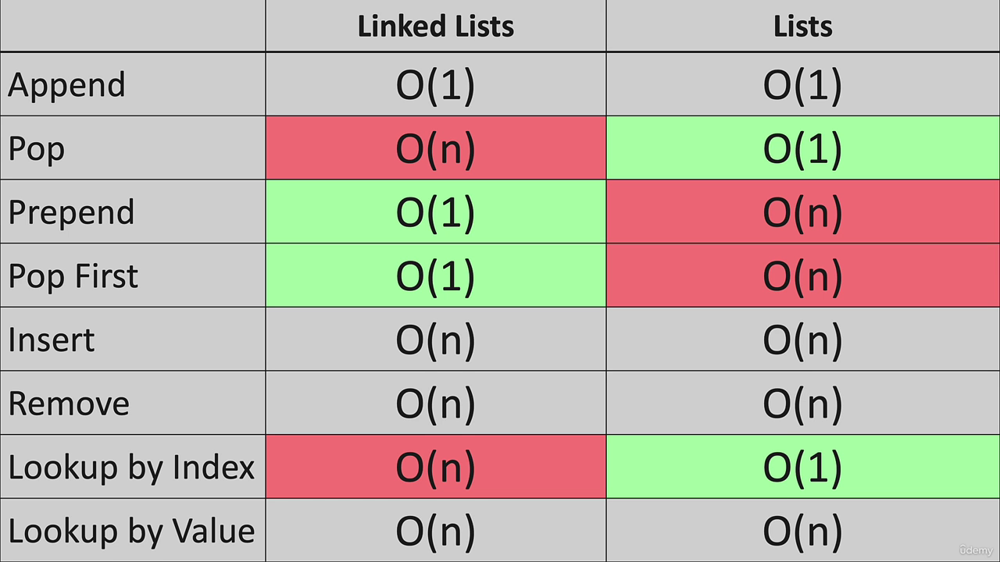
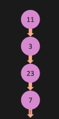

1. **Big O Drop Constants** Although it is running n+n times, we can asssume that the time complexity be O(2n). But for this case we drop the constants and the complexity will be O(n).
2. **Big O Drop Non-Dominants**

   ```
   def print_items(n):
       for i in range(n):
           for j in range(n):
               print(i, j)

       for k in range(n):
           print(k)

   print_items(10)
   ```
   Here the time complexity seem to be O(n^2 + n). But we can drop the non dominant term 'n' and the time complexity will be O(n^2).
3. **Different Terms of Input**

   ```
   def print_items(a, b):
       for i in range(a):
           print(i)

       for j in range(b):
           print(j)
   print_items(5, 6)

   def print_items_nested(a, b):
       for i in range(a):
           for j in range(b):
               print(i, j)
   print_items_nested(5, 6)
   ```
   For the first function the Big_O notation is O(a+b), and for the second function O(a*b).
4. Goto Big O CheatSheet.com
5. Difference in Big O between Linked List and List

   
6. **Stack using Linked List** should be made like this  , where the head node indicates the last item in the stack. This approach is much better as pop or push operation has time complexity of O(1) in this.
7. For **Queue using Linked List,** there need to be two pointers pointing to the head and tail nodes, the push operation is done in the head and pop is done in the tail. By maintaining two nodes, the time complexity for push and pop operation is O(1).
8. **Tree:**

   i. In a **Full Tree**, every node has either 2 or 0 child nodes.

   ii. A **Perfect Binary Tree** is a special type of binary tree in which all the leaf nodes are at the same depth, and all non-leaf nodes have two children.

   iii. A **Complete Binary Tree** is a binary tree in which all the levels are completely filled except possibly the lowest one, which is filled from the left.

   iv. Each node in a ****Binary Search Tree**** has at most two children, a ****left**** child and a ****right**** child, with the ****left**** child containing values less than the parent node and the ****right**** child containing values greater than the parent node.
9.
